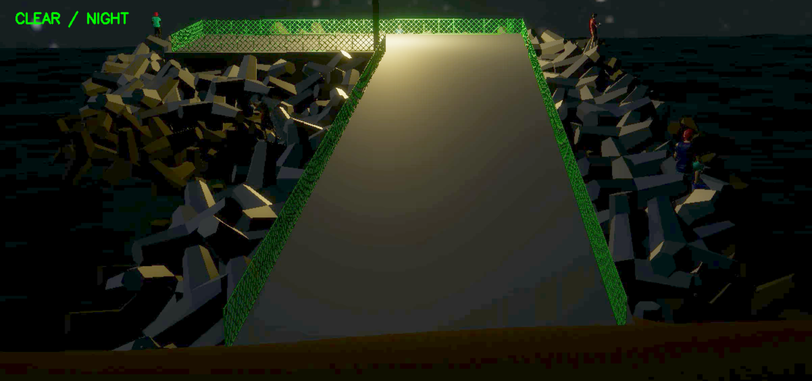

# FCDN
<p align="center">
  
  
</p>

<p align="center">
  <em>Example inference results of FCDN (Foggy/Clear and Day/Night)</em>
</p>

**FCDN (Foggy/Clear & Day/Night Detector)**  
A video-based classification project that automatically determines **day/night** conditions and **fog presence** from real-world surveillance videos.

---

## Overview

## FCDN 개요

FCDN은 입력 영상을 분석하여 환경 조건을 분류하기 위해 설계된 경량화되고 해석 가능한 파이프라인입니다.  
본 시스템은 복잡한 딥러닝 구조 대신, 명확한 처리 흐름과 시각적 특징 기반 분류를 통해 실시간 환경 인식을 목표로 합니다.  
특히 안개 유무 분류 단계에서는 단일 MLP 모델만을 사용하여 **F1-score 0.98**의 성능을 달성함으로써, 경량 모델 기반 환경 인식의 실효성을 검증하였습니다.

---

## Pipeline
1. **Day / Night Classification**
   - Based on average frame brightness
   - Threshold-based decision (default: 100)

2. **Night-time Enhancement**
   - Gamma correction applied when classified as NIGHT (gamma = 2.0)

3. **Foggy / Clear Classification**
   - Extracts 7 numerical visual features
   - Uses a trained **MLP binary classifier**

---

## Project Structure
```text
FCDN/
├─ images/
│  ├─ example_foggy_day.png
│  └─ example_clear_night.png
├─ .gitignore
├─ README.md
├─ main.py
├─ day_night_detector.py
├─ foggy_clear_detector.py
├─ tetra_brighten.py
├─ best_mlp_strong_focal.pth
├─ clear_day_tetra.mp4
├─ clear_night_tetra.mp4
├─ foggy_day_tetra.mp4
└─ foggy_night_tetra.mp4
```

---

## Visual Features for Fog Classification (7)
- `haze_strength` (currently fixed to 0)
- `sharpness`
- `brightness`
- `contrast`
- `edge_density`
- `dark_mean`
- `saturation`

---

## Requirements
```bash
pip install opencv-python numpy torch
```

## Usage
```bash
python main.py
```
Press `q` to quit.

## Configuration
- **Day/Night threshold**: `day_night_detector.py`
- **Fog classification threshold**: `foggy_clear_detector.py`

## Applications
- CCTV environment perception
- Smart city monitoring
- Port and coastal surveillance
- Preprocessing for vision-based systems

## Author
- GitHub: https://github.com/DongHyun925
